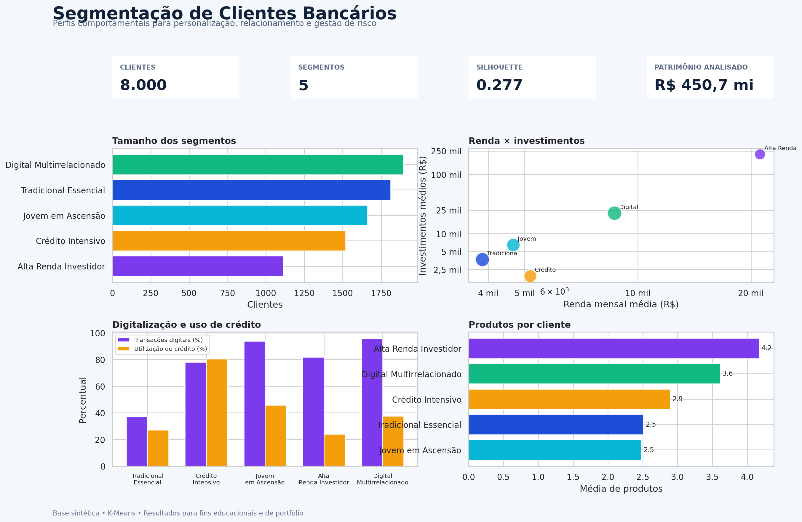
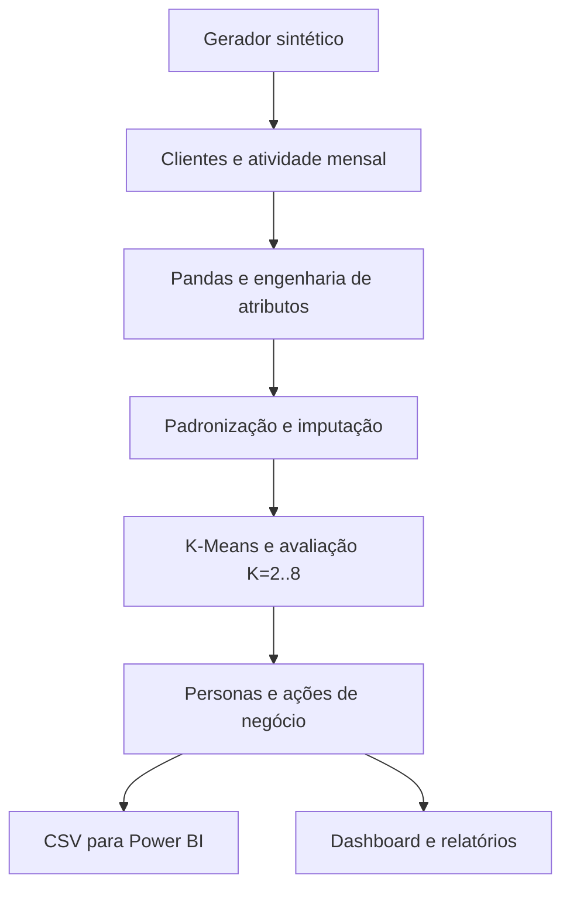

# Segmentação de Clientes Bancários

[](requirements.txt)
[](src/features.py)
[](src/segmentation.py)
[](powerbi/)
[](https://github.com/Gmerick/segmentacao-clientes-bancarios/actions/workflows/ci.yml)

Projeto de portfólio que agrupa clientes de uma instituição financeira de acordo com comportamento, renda, produtos contratados, patrimônio, crédito e movimentações mensais. A solução utiliza **Pandas** para engenharia de atributos, **Scikit-learn** para clusterização K-Means e entrega tabelas, medidas DAX, tema e blueprint para um dashboard no **Power BI**.

> A base é integralmente sintética e determinística. Não contém dados pessoais ou bancários reais.



## Resultado executivo

| Indicador | Resultado |
|---|---:|
| Clientes analisados | 8.000 |
| Registros mensais | 96.000 |
| Período | jan–dez/2025 |
| Segmentos de negócio | 5 |
| Silhouette para K=5 | 0,277 |
| ARI contra arquétipos sintéticos | 0,942 |
| Patrimônio analisado | R$ 450,68 milhões |
| Maior segmento | Digital Multirrelacionado — 1.894 clientes |

O **Adjusted Rand Index (ARI)** é apenas uma validação do experimento sintético. O perfil original nunca é fornecido ao K-Means e não seria conhecido em uma aplicação real.

## Segmentos encontrados

| Segmento | Clientes | Perfil dominante | Ação sugerida |
|---|---:|---|---|
| Digital Multirrelacionado | 1.894 | Alto uso do app, muitas transações e vários produtos | Cross-sell contextual e jornadas digitais personalizadas |
| Tradicional Essencial | 1.812 | Relacionamento longo, baixa digitalização e uso de agência | Migração digital assistida e simplificação da jornada |
| Jovem em Ascensão | 1.662 | Jovens digitais com patrimônio em formação | Educação financeira e produtos de entrada |
| Crédito Intensivo | 1.520 | Exposição e utilização de crédito elevadas | Gestão preventiva de risco e renegociação |
| Alta Renda Investidor | 1.112 | Alta renda, patrimônio e investimentos | Retenção premium e assessoria de investimentos |

## Por que K=5?

Foram comparadas soluções de **K=2 até K=8** com inertia, silhouette, Calinski-Harabasz e Davies-Bouldin. K=2 e K=3 apresentaram maior separação geométrica, mas condensaram comportamentos comercialmente distintos. K=5 foi selecionado por equilibrar:

- diferenciação de renda, patrimônio, digitalização e crédito;
- tamanho suficiente para campanhas e acompanhamento;
- personas interpretáveis e acionáveis;
- alta recuperação dos arquétipos sintéticos, com ARI de 0,942;
- complexidade administrável para operação e Power BI.

Essa escolha demonstra que clusterização não deve ser decidida por uma única métrica. A utilidade de negócio e a estabilidade dos perfis também importam.

## Arquitetura



## Atributos usados no modelo

O K-Means utiliza 18 atributos numéricos:

- idade, renda mensal e tempo de relacionamento;
- quantidade de produtos;
- saldos em conta, poupança e investimentos;
- limite e utilização do cartão;
- saldo de empréstimos e atrasos em 12 meses;
- transações, entradas e saídas médias mensais;
- logins no app e visitas à agência;
- participação digital e volatilidade das movimentações.

O identificador, região, ocupação e arquétipo sintético são excluídos do treinamento.

## Estrutura do projeto

```text
segmentacao-clientes-bancarios/
├── data/
│   ├── raw/                 # Clientes e atividade mensal sintéticos
│   └── processed/           # Segmentos, perfis e tabelas para Power BI
├── docs/                    # Metodologia, dicionário, uso e entrevista
├── models/                  # Metadados e artefato local do pipeline
├── notebooks/               # Análise exploratória guiada
├── powerbi/                 # Modelo, DAX, tema e blueprint
├── reports/                 # Dashboard, insights, métricas e gráficos
├── scripts/                 # Utilitários de manutenção
├── src/                     # Geração, features, clustering e relatórios
├── tests/                   # Testes automatizados
├── run_pipeline.py          # Orquestrador ponta a ponta
└── requirements.txt
```

## Como executar

Requer Python 3.10 ou superior.

```bash
git clone https://github.com/Gmerick/segmentacao-clientes-bancarios.git
cd segmentacao-clientes-bancarios
python -m venv .venv
```

Windows PowerShell:

```powershell
.venv\Scripts\Activate.ps1
python -m pip install -r requirements.txt
python run_pipeline.py
python -m unittest discover -s tests -v
```

Linux ou macOS:

```bash
source .venv/bin/activate
python -m pip install -r requirements.txt
python run_pipeline.py
python -m unittest discover -s tests -v
```

O pipeline recria os dados, agrega os 12 meses, trata ausências, avalia K=2–8, treina K=5, nomeia os clusters, exporta as tabelas e gera os gráficos.

## Power BI

1. Importe `data/processed/customer_segments.csv`.
2. Importe `segment_profiles.csv` e `monthly_segment_activity.csv`.
3. Construa o modelo de [`powerbi/data_model.md`](powerbi/data_model.md).
4. Adicione as medidas de [`powerbi/dax_measures.md`](powerbi/dax_measures.md).
5. Importe [`powerbi/theme_customer_segmentation.json`](powerbi/theme_customer_segmentation.json).
6. Monte as páginas conforme [`powerbi/dashboard_layout.md`](powerbi/dashboard_layout.md).

O `.pbix` não é versionado porque é binário e proprietário. Dados, modelo, DAX, tema e layout permanecem abertos, auditáveis e reproduzíveis.

## Principais insights

- **Digital Multirrelacionado** é o maior grupo, com 23,7% da base, 95,8% das transações em canais digitais e média de 3,6 produtos.
- **Alta Renda Investidor** representa 13,9% dos clientes, mas concentra patrimônio e investimentos muito acima dos demais grupos.
- **Crédito Intensivo** apresenta utilização média do cartão de 80,5%, exposição média de R$ 50,8 mil e maior incidência de atraso.
- **Tradicional Essencial** tem idade média de 57,6 anos, 37,1% de participação digital e maior frequência de agência.
- **Jovem em Ascensão** combina idade média de 27 anos, 93,9% de participação digital e oportunidade de evolução de portfólio.

Leia a análise detalhada em [`reports/insights.md`](reports/insights.md).

## Como apresentar em uma entrevista

> Desenvolvi um projeto ponta a ponta de segmentação de clientes bancários com oito mil clientes sintéticos e 96 mil registros mensais. Usei Pandas para consolidar comportamento, renda, produtos, patrimônio, crédito e canais em 18 atributos. Depois padronizei as variáveis e comparei soluções K-Means de dois a oito clusters com quatro métricas. Selecionei cinco segmentos por equilíbrio entre qualidade estatística e utilidade de negócio. Os grupos geraram estratégias distintas para alta renda, clientes digitais, usuários intensivos de crédito, clientes tradicionais e jovens em ascensão. Também preparei tabelas, medidas DAX, tema e layout para Power BI, além de testes automatizados e GitHub Actions. Como a base é sintética, consegui validar a recuperação dos padrões com ARI de 0,942, sem usar o perfil original no treinamento.

O roteiro completo está em [`docs/roteiro_entrevista.md`](docs/roteiro_entrevista.md).

## Limitações e uso responsável

- Os resultados são educacionais e não devem orientar decisões reais sem validação adicional.
- Segmentos não determinam capacidade financeira, risco individual ou tratamento comercial automático.
- K-Means pressupõe distância euclidiana e clusters aproximadamente convexos.
- A nomenclatura das personas é uma interpretação posterior aos clusters.
- Em produção, seria necessário avaliar estabilidade temporal, viés, consentimento, LGPD e monitoramento.

## Licença

Distribuído sob a licença MIT. Consulte [`LICENSE`](LICENSE).

